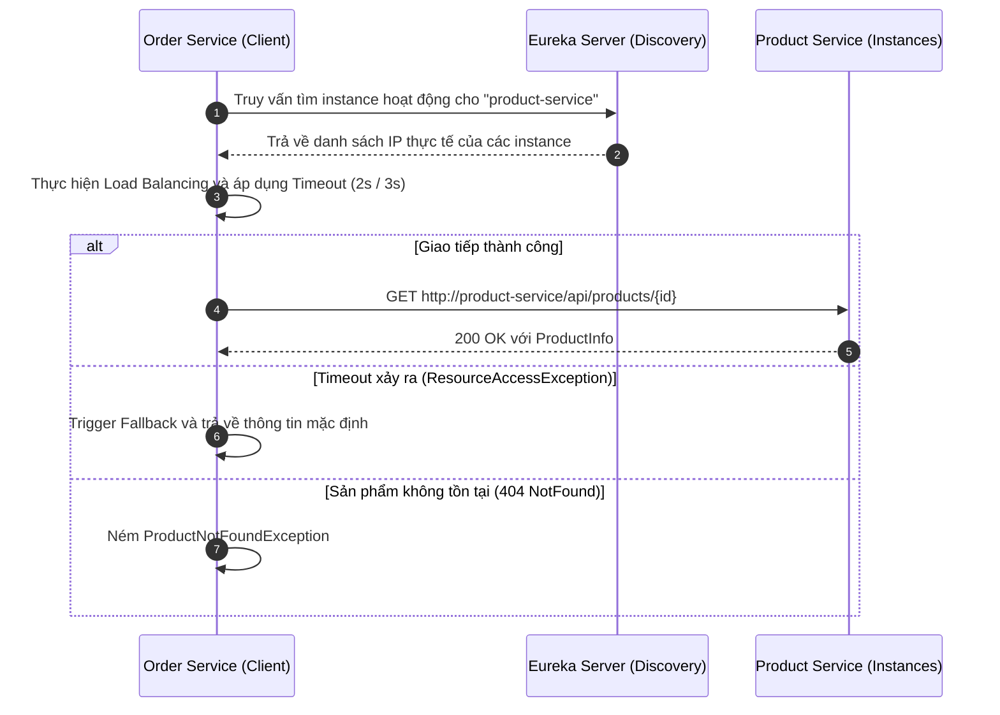

# Dự Án Sửa Lỗi Hardcode URL Và Tối Ưu Hóa RestTemplate

Dự án này giải quyết triệt để lỗi thắt nút cổ chai (bottleneck) và hardcode IP trong giao tiếp đồng bộ giữa `order-service` và `product-service` bằng cách sử dụng Eureka Discovery, Spring Cloud LoadBalancer và cơ chế Fallback thích ứng.

## Cấu Trúc Thư Mục Hệ Thống
```text
order-service/
├── src/
│   ├── main/java/com/vietmart/orderservice/
│   │   ├── client/ProductServiceClientRT.java  (Client gọi API và xử lý lỗi)
│   │   ├── config/RestTemplateConfig.java      (Cấu hình LoadBalanced RestTemplate với Timeout)
│   │   ├── dto/ProductInfo.java                (DTO truyền nhận dữ liệu)
│   │   └── exception/ProductNotFoundException.java (Exception nghiệp vụ 404)
│   └── test/java/com/vietmart/orderservice/
│       └── client/ProductServiceClientRTTest.java  (Unit tests đầy đủ các kịch bản)
└── README.md
```

## Quy Trình Giao Tiếp Giữa Các Service



## Cách Chạy Unit Test
Để thực thi kiểm thử và đảm bảo hoạt động đúng đắn của logic client:
```bash
mvn clean test
```
